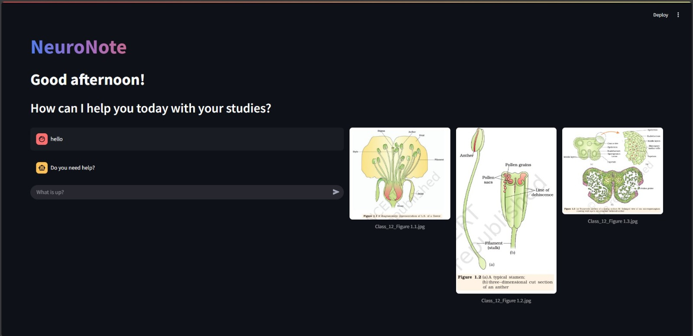
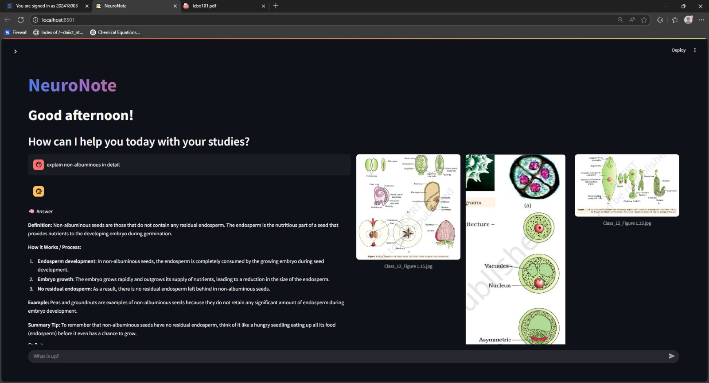
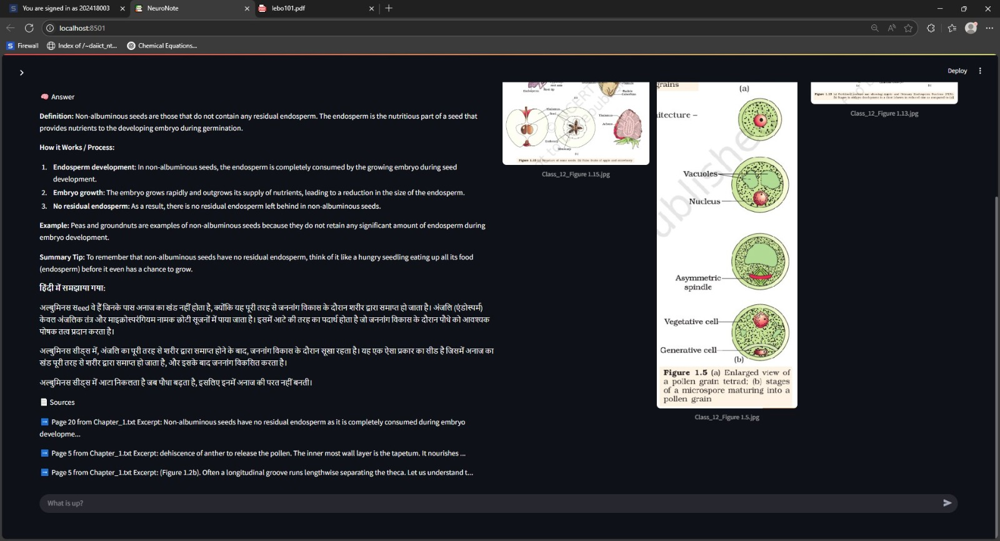
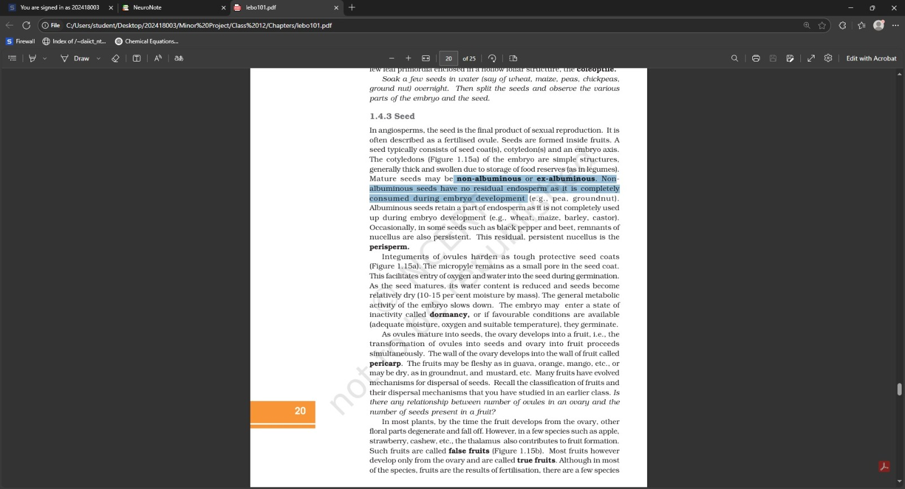
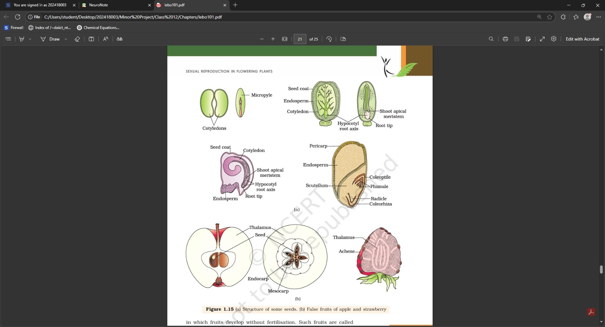

# NeuroNote — An AI-Powered Study Assistant with RAG and Image-Based Learning

**NeuroNote** is a Streamlit-based study assistant that leverages a Retrieval-Augmented Generation (RAG) pipeline to answer academic questions from Class 12 textbooks. It also finds and displays relevant textbook diagrams using semantic similarity, and allows students to save notes

---

##  Features

-  **Ask Questions**: Query textbook content using natural language.
-  **LLM-Powered Answers**: Uses a local LLaMA-based model with a custom system prompt.
-  **Source Tracking**: View exact textbook page and excerpt used for each answer.
-  **Relevant Image Retrieval**: Matches answers with the most relevant textbook diagrams.
-  **Save to Notes**: Automatically stores your question, answer, sources, and image paths in a PostgreSQL database.
-  **Chat History**: Browse all saved Q&A pairs with images.
-  **Filters**: Search and filter notes by keyword or date range.

---

## 🧱 Tech Stack

| Component            | Tech Used                                      |
|----------------------|------------------------------------------------|
| Frontend             | [Streamlit](https://streamlit.io/)             |
| Embeddings           | `sentence-transformers/all-MiniLM-L6-v2`       |
| Language Model       | LLaMA (via Ollama)                             |
| Vector Store         | FAISS                                           |
| Database             | PostgreSQL                                     |

---

## 🧪 Getting Started

### 1️⃣ Clone the repo

```bash
git clone https://github.com/your-username/NeuroNote.git
cd NeuroNote
```

### 2️⃣ Install Dependencies

```bash
pip install -r requirements.txt
```

### 3️⃣ Setup PostgreSQL

Create the following table:

```sql
CREATE TABLE study_notes (
    id SERIAL PRIMARY KEY,
    prompt TEXT,
    response TEXT,
    source TEXT,
    img_list TEXT[],
    timestamp TIMESTAMPTZ DEFAULT NOW()
);
```

Set your DB credentials in `db_utils.py`:

```python
DB_CONFIG = {
    "dbname": "your_db_name",
    "user": "your_username",
    "password": "your_password",
    "host": "localhost",
    "port": "5432"
}
```

### 4️⃣ Run the App

```bash
cd UI/pages
streamlit run UI_v3.py
```

---

## 🖋️ Example Use Case

> "Explain the difference between DNA and RNA"

* 💬 **Prompt**: You ask the question.
* 📘 **Answer**: LLaMA gives you a precise explanation.
* 📄 **Source**: Shows textbook page where info came from.
* 🖼️ **Images**: 3 diagrams related to DNA/RNA.
* 💾 **Saved**: Everything is saved to PostgreSQL.
* 📤 **Export**: Export as PDF later.

---

## 🔹 Demo Video

<video width="600" controls>
  <source src="video/demo_video1.mp4" type="video/mp4">
  Your browser does not support the video tag.
</video>


## 📸 Screenshots







---

## ✨ Future Enhancements

* ✅ Tag-based organization of notes
* ✅ Single note export
* 🔒 User login/authentication
* 📱 Mobile responsive layout
* 🌐 Web deployment (Streamlit Community Cloud or AWS)

---

## 🧑‍💻 Author

**Aman Rajput**
📧 \(ar1632002@gmail.com)
🌐 [LinkedIn](https://www.linkedin.com/in/aman-rajput-7a3a262a7/) | [GitHub](https://github.com/Aman-Rajput-dev)

---

## 📝 License

This project is licensed under the MIT License.
Feel free to use, modify, and share.

---
