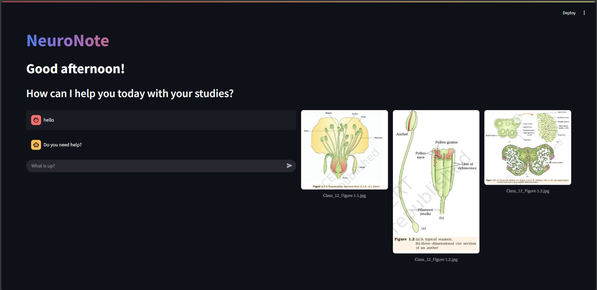
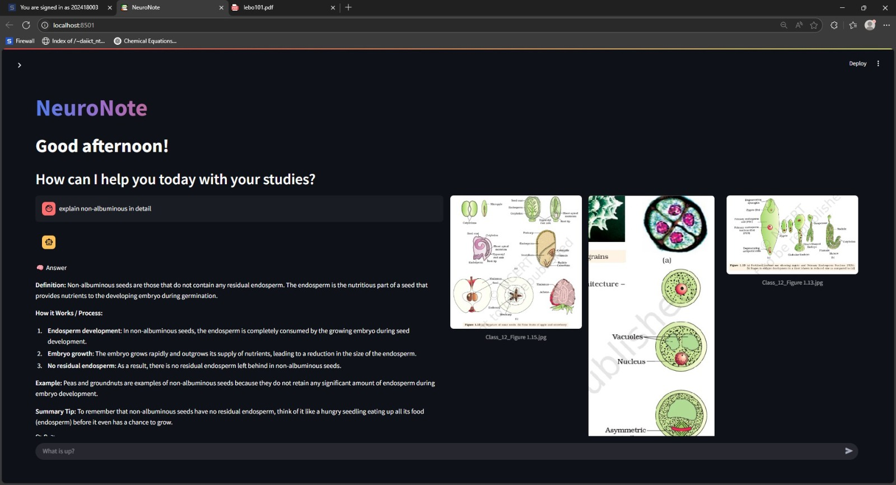
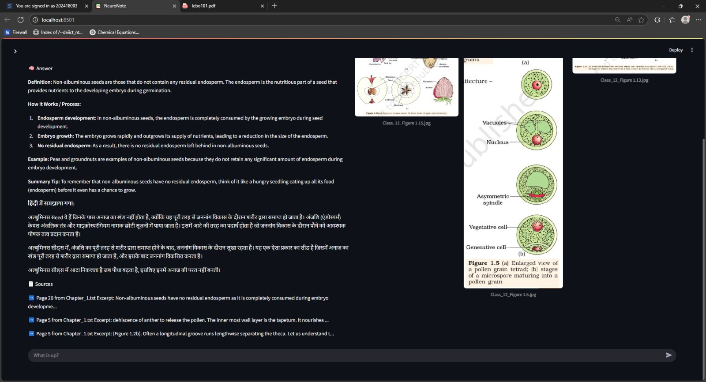
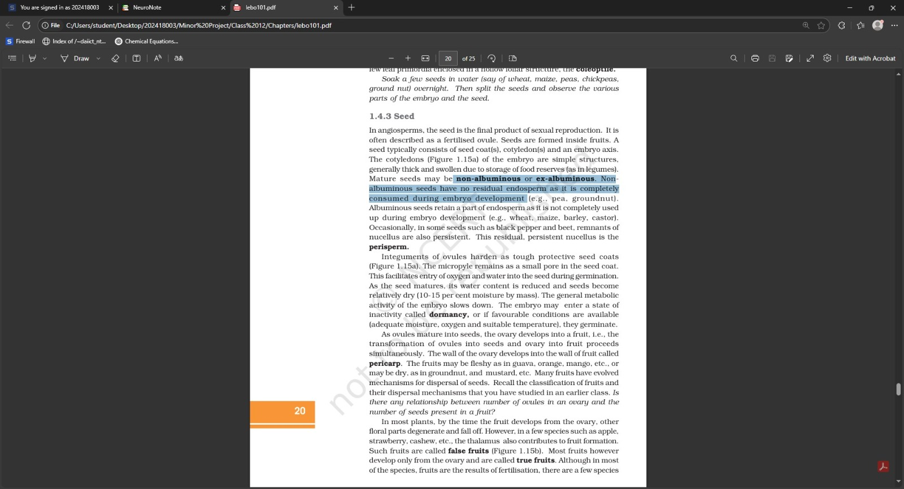
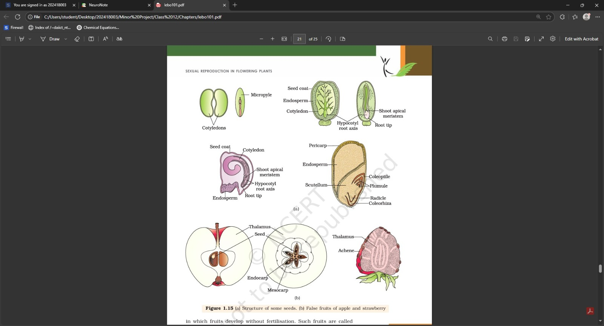

# NeuroNote — An AI-Powered Study Assistant with RAG and Image-Based Learning

**NeuroNote** is a Streamlit-based study assistant that leverages a Retrieval-Augmented Generation (RAG) pipeline to answer academic questions from Class 12 textbooks. It also finds and displays relevant textbook diagrams using semantic similarity, and allows students to save notes

---

##  Features

-  **Ask Questions**: Query textbook content using natural language.
-  **LLM-Powered Answers**: Uses a local LLaMA-based model with a custom system prompt.
-  **Source Tracking**: View exact textbook page and excerpt used for each answer.
-  **Relevant Image Retrieval**: Matches answers with the most relevant textbook diagrams.
-  **Save to Notes**: Automatically stores your question, answer, sources, and image paths in a PostgreSQL database.
-  **Chat History**: Browse all saved Q&A pairs with images.
-  **Filters**: Search and filter notes by keyword or date range.

---

## 🧱 Tech Stack

| Component            | Tech Used                                      |
|----------------------|------------------------------------------------|
| Frontend             | [Streamlit](https://streamlit.io/)             |
| Embeddings           | `sentence-transformers/all-MiniLM-L6-v2`       |
| Language Model       | LLaMA (via Ollama)                             |
| Vector Store         | FAISS                                           |
| Database             | PostgreSQL                                     |

---

## 🧪 Getting Started

### 1️⃣ Clone the repo

```bash
git clone https://github.com/your-username/NeuroNote.git
cd NeuroNote
```

### 2️⃣ Install Dependencies

```bash
pip install -r requirements.txt
```

### 3️⃣ Setup PostgreSQL

Create the following table:

```sql
CREATE TABLE study_notes (
    id SERIAL PRIMARY KEY,
    prompt TEXT,
    response TEXT,
    source TEXT,
    img_list TEXT[],
    timestamp TIMESTAMPTZ DEFAULT NOW()
);
```

Set your DB credentials in `db_utils.py`:

```python
DB_CONFIG = {
    "dbname": "your_db_name",
    "user": "your_username",
    "password": "your_password",
    "host": "localhost",
    "port": "5432"
}
```

### 4️⃣ Run the App

```bash
cd UI/pages
streamlit run UI_v3.py
```

---
# Image-to-Text Biology Explanation System

## Project Overview

This project implements an **Image-to-Text explanation system** for biological diagrams using **computer vision**, **vector similarity search**, and **large language models (LLMs)**.
The system takes a user-uploaded biology image and generates a **factually grounded textual explanation** using a **Retrieval-Augmented Generation (RAG)** approach.

The primary goal is to assist students in understanding complex biological diagrams accurately and reliably.

---

## System Architecture

The pipeline integrates the following components:

* **CLIP** for image embeddings
* **FAISS** for similarity-based image retrieval
* **Vision LLM** for visual captioning
* **Text LLM** for explanation generation

This hybrid approach ensures that the output is both visually informed and knowledge-grounded.

---

## Dataset

The dataset consists of:

* Biology textbook diagrams (Class 11–12 level)
* Corresponding expert-written captions

Each image-caption pair is stored in a CSV file and used as the retrieval knowledge base.

---

## Methodology

### 1. Image Embedding (CLIP)

* Images are preprocessed and passed through a CLIP vision encoder.
* Each image is converted into a **512-dimensional embedding vector**.
* These embeddings capture semantic and visual features of the diagrams.

---

### 2. Vector Database (FAISS)

* All dataset embeddings are indexed using **FAISS**.
* L2 distance is used for similarity search.
* Enables fast retrieval of **Top-K similar images**.

---

### 3. User Image Processing

When a user uploads an image:

1. The image is embedded using the same CLIP model.
2. FAISS retrieves the most visually similar images.
3. Captions of retrieved images are collected as trusted context.

---

### 4. Vision Caption Generation

* A vision-capable LLM (Qwen-VL) generates a **biology-focused caption** directly from the uploaded image.
* This captures visual cues not always present in stored captions.

---

### 5. Retrieval-Augmented Prompting

A structured prompt is constructed using:

* Vision-generated caption
* Retrieved dataset captions

The model is explicitly instructed to:

* Use only the provided context
* Avoid hallucinations
* Produce accurate biological explanations

---

### 6. Text Explanation Generation

* A text-based LLM (LLaMA) processes the RAG prompt.
* Generates a **clear, concise, and student-friendly explanation** of the diagram.

---

## Output

The system returns:

* Vision-based caption
* Retrieved captions from similar images
* Final biologically accurate explanation

---

## Key Features

* Retrieval-Augmented Generation (RAG)
* Reduced hallucination
* Vision + text reasoning
* Fast similarity search using FAISS
* Educationally reliable outputs

---

## Technologies Used

* Python
* CLIP (Sentence Transformers)
* FAISS
* Ollama (Vision + Text LLMs)
* PIL, PyTorch, Pandas

---

##  Use Cases

* Biology education platforms
* Student learning assistance
* Diagram-based Q&A systems
* Academic and research projects

---

##  Conclusion

This project demonstrates an effective fusion of computer vision and natural language processing using RAG. By grounding LLM outputs in retrieved visual knowledge, the system produces reliable and interpretable explanations for biological diagrams, making it suitable for educational applications.

---

## 🚀 Future Enhancements

* Support for multi-language explanations
* Interactive question-answering on diagrams
* Expansion to other science domains (Physics, Chemistry)
* Improved fine-tuned vision-language models

---

## 🔹 Demo Video
This is for Text to Image 
[Click here to watch the demo](video/demo_video1.mp4)

This is for Image to Text
[Click here to watch the demo](video/ImagetoTextDemo.mp4)


## 📸 Screenshots







---

## ✨ Future Enhancements

* ✅ Tag-based organization of notes
* ✅ Single note export
* 🔒 User login/authentication
* 📱 Mobile responsive layout
* 🌐 Web deployment (Streamlit Community Cloud or AWS)

---
## 🧑‍💻 Author
- **Siddharth Kumar**  
  📧 (siddharth27april2000@gmail.com)  
  🌐 [LinkedIn](https://www.linkedin.com/in/siddharth-kumar2002/) | [GitHub](https://github.com/siddharth2704)

- **Aman Rajput**  
  📧 (ar1632002@gmail.com)  
  🌐 [LinkedIn](https://www.linkedin.com/in/aman-rajput-7a3a262a7/) | [GitHub](https://github.com/Aman-Rajput-dev)

- **Adarsh Ambastha**  
  📧 (adarshambastha18@gmail.com)  
  🌐 [LinkedIn](https://www.linkedin.com/in/adarsh-dau/) | [GitHub](https://github.com/Adarsh-Ambastha)

---

## 📝 License

This project is licensed under the MIT License.
Feel free to use, modify, and share.

---
